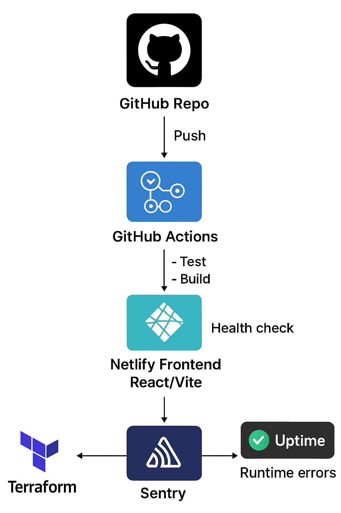

# Moje SRE Portfolio

## Stack
- React frontend (host: Netlify)
- CI/CD: GitHub Actions (testing + Lighthouse)
- Monitoring uptime: health endpoint + Uptime Kuma / BetterStack
- Runtime errors: Sentry
- Infrastructure as Code: Terraform

## CI/CD

## Monitoring / Observability
- Uptime badge: 

- Dashboard screenshot: see `/docs/dashboard.png`

## Incident log
Zobacz [`INCIDENTS.md`](./INCIDENTS.md)

## Architektura

