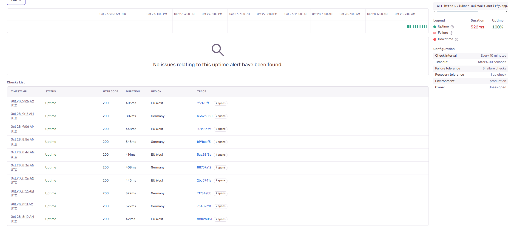

# Frontend | SRE - Portfolio

## Stack
- React frontend (host: Netlify)
- CI/CD: GitHub Actions (testing + Lighthouse)
- Monitoring uptime: health endpoint + Shields.io
- Runtime errors: Sentry

## CI/CD

## Monitoring / Observability
- Uptime badge: 
- Runtime errors: Sentry (application error monitoring)
- Dashboard screenshot: see `

## Incident log
Zobacz [`INCIDENTS.md`](./INCIDENTS.md)

## Architecture

