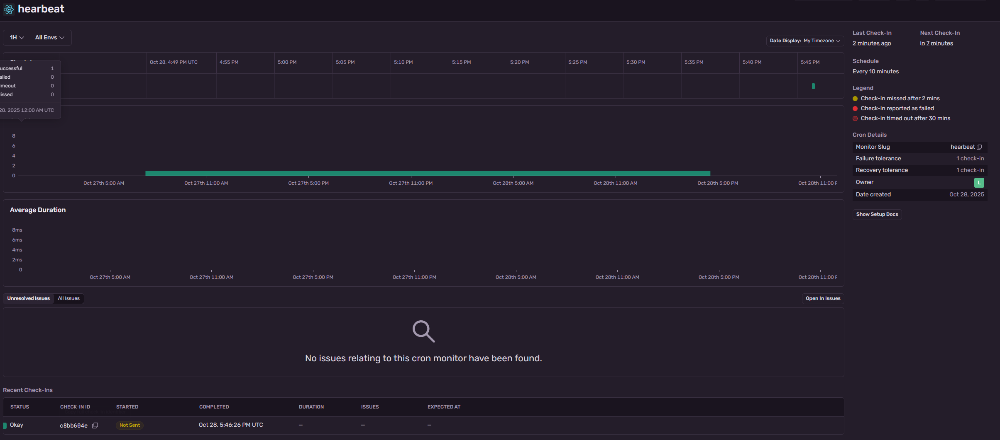
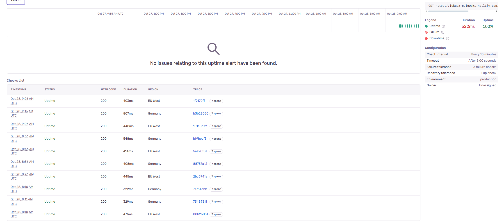
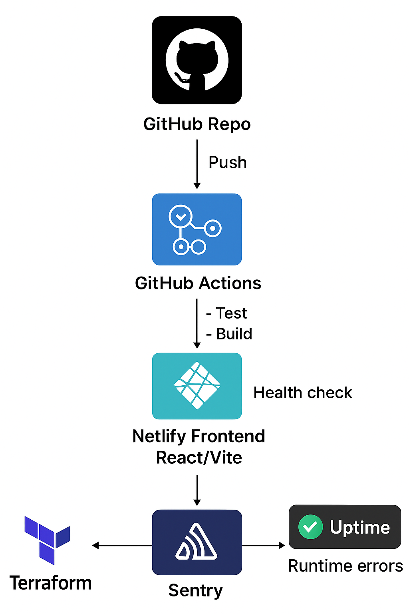

# ⚡ Frontend | SRE Portfolio

## 🧱 Stack
- **Frontend:** React (hosted on Netlify)  
- **CI/CD:** GitHub Actions (build, test & deploy pipeline)  
- **Monitoring:** `/health` endpoint + Shields.io badges  
- **Error tracking:** Sentry (runtime monitoring)  
- **Focus:** Observability • Reliability • Automation

---

## 🚀 CI/CD

---

## 🩺 Monitoring & Observability

### 🟢 Uptime

### 🧭 Heartbeat Monitoring

> Runtime alerts and uptime metrics are tracked via **Sentry Heartbeat** and custom `/health` endpoint.  
> Below: example dashboards from live monitoring.

---

## 📜 Incident Log
See [`INCIDENTS.md`](./INCIDENTS.md) for recorded build and uptime incidents.

---

## 🧩 Architecture
