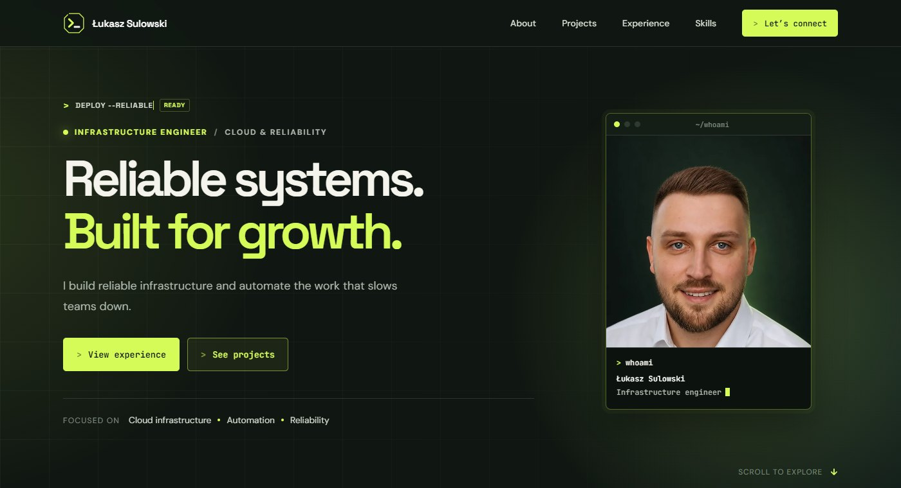
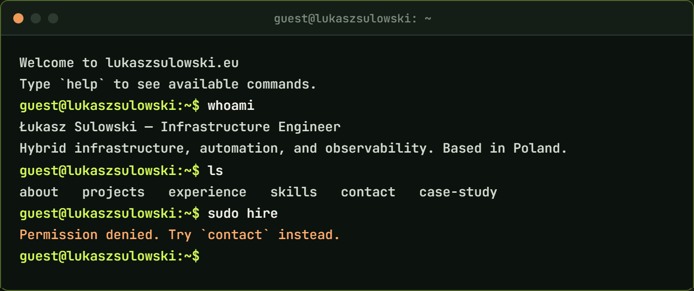
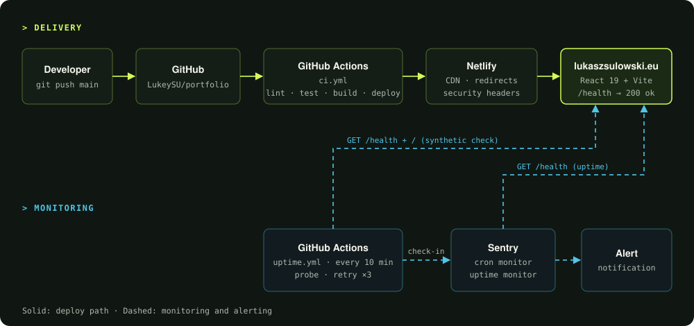

# Łukasz Sulowski — Portfolio

Personal portfolio of an infrastructure engineer, built and operated like a small production service:
a CI/CD pipeline, security headers, a health endpoint, synthetic monitoring, alerting and an incident log.

**Live:** [lukaszsulowski.eu](https://lukaszsulowski.eu)

[](https://github.com/LukeySU/portfolio/actions/workflows/ci.yml)
[](https://app.netlify.com/projects/lukasz-sulowski/deploys)
[](https://lukaszsulowski.eu/health)
[](https://github.com/LukeySU/portfolio/actions/workflows/uptime.yml)

[](https://lukaszsulowski.eu)

---

## Highlights

- **Terminal-inspired UI** — React 19 + Vite, no UI framework. Custom design tokens, reveal-on-scroll, reduced-motion support.
- **Hidden terminal** — press <kbd>~</kbd> on the site (`help`, `whoami`, `ls`, `projects`, `email`, …), with tab completion and history.
- **Case study page** — [Kubernetes Reliability Lab](https://lukaszsulowski.eu/case-study/kubernetes-reliability-lab): failure drill, alert rule fix and evidence.
- **Real 404** — unknown paths return HTTP `404` and a terminal-style error page.
- **Build info in the footer** — commit SHA and build date are injected at build time (`deployed <sha> · <date>`).

<p align="center">
  
</p>

---

## Architecture



## CI/CD

Every push to `main` runs [`ci.yml`](./.github/workflows/ci.yml):

| Job | What it does |
|---|---|
| **build** | `npm ci` → `npm run lint` (ESLint) → `npm run build` (Vite) |
| **test** | Vitest + Testing Library, with coverage report |
| **deploy** | Netlify CLI production deploy — runs only when build and test pass |

The deploy is gated on the previous jobs, so a failing lint or test never reaches production.

## Monitoring & alerting

| Layer | How | Frequency |
|---|---|---|
| Health endpoint | [`/health`](https://lukaszsulowski.eu/health) → `{"status":"ok"}` (static JSON behind a Netlify rewrite) | — |
| Synthetic check | [`uptime.yml`](./.github/workflows/uptime.yml) probes `/health` (asserting the body, not just the status code) and the homepage, with 3 retries | every 10 min |
| Heartbeat | the synthetic check reports `ok` / `error` to a **Sentry cron monitor**; the monitor's schedule and grace period are defined in the workflow, not clicked in the UI | every 10 min |
| External uptime | **Sentry uptime monitor** probes `/health` from Sentry's regions | every 5 min |
| Alerting | Sentry raises an alert on failed checks and on missed check-ins | — |

The *status* badge above is checked live by Shields.io; *uptime check* reflects the latest workflow run.

## Security

HTTP response headers are configured in [`netlify.toml`](./netlify.toml):

| Header | Value (summary) |
|---|---|
| `Content-Security-Policy` | `default-src 'self'`; fonts only from Google Fonts; no inline scripts except one hash-allowlisted `onload` handler; `frame-ancestors 'none'` |
| `Strict-Transport-Security` | provided by Netlify |
| `X-Content-Type-Options` | `nosniff` |
| `X-Frame-Options` | `DENY` |
| `Referrer-Policy` | `strict-origin-when-cross-origin` |
| `Permissions-Policy` | camera, microphone, geolocation, payment, USB and Topics disabled |
| `Cross-Origin-Opener-Policy` | `same-origin` |

Hashed build assets are served with `Cache-Control: public, max-age=31536000, immutable`.

## Performance & SEO

Lighthouse (production build):

| | Performance | Accessibility | Best practices | SEO |
|---|---|---|---|---|
| Mobile | 99 | 100 | 100 | 100 |
| Desktop | 100 | 100 | 100 | 100 |

- Images served as WebP with `srcset`, fonts loaded without blocking rendering.
- `robots.txt`, `sitemap.xml`, canonical URL per page, Open Graph image and JSON-LD (`Person`) structured data.

## Incident log

Build, deploy and monitoring incidents are recorded as short postmortems in [`INCIDENTS.md`](./INCIDENTS.md).

---

## Local development

Requires Node.js 24.

```bash
npm ci            # install dependencies
npm run dev       # dev server on http://localhost:5173
npm run lint      # ESLint
npm test          # Vitest (watch mode; use `npx vitest --run` for a single run)
npm run build     # production build into dist/
npm run preview   # serve the production build locally
```

## Project structure

```text
.github/workflows/   ci.yml (build → test → deploy), uptime.yml (synthetic check)
docs/                images used in this README
public/              static files: health.json, robots.txt, sitemap.xml, og-image.jpg
src/components/      page sections, TermLink, Terminal, NotFound, CaseStudy
src/styles/          one stylesheet per component; design tokens in src/index.css
netlify.toml         redirects, 404 handling, security and cache headers
INCIDENTS.md         incident log
```
