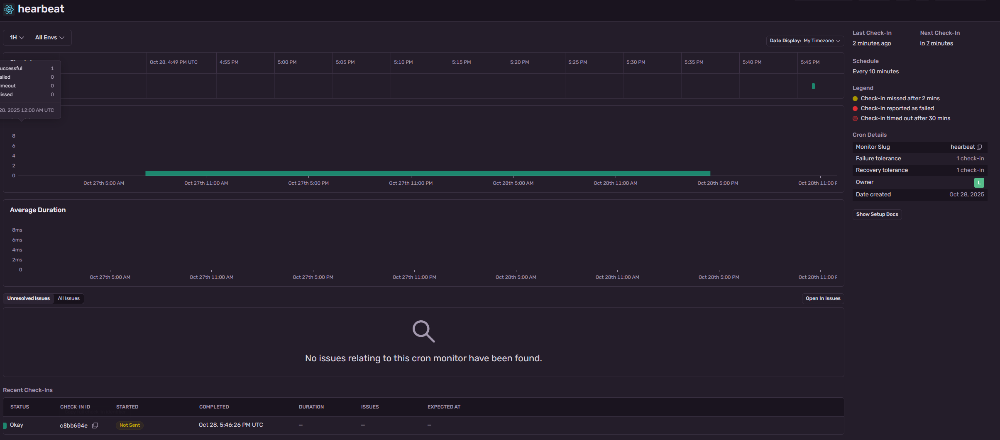
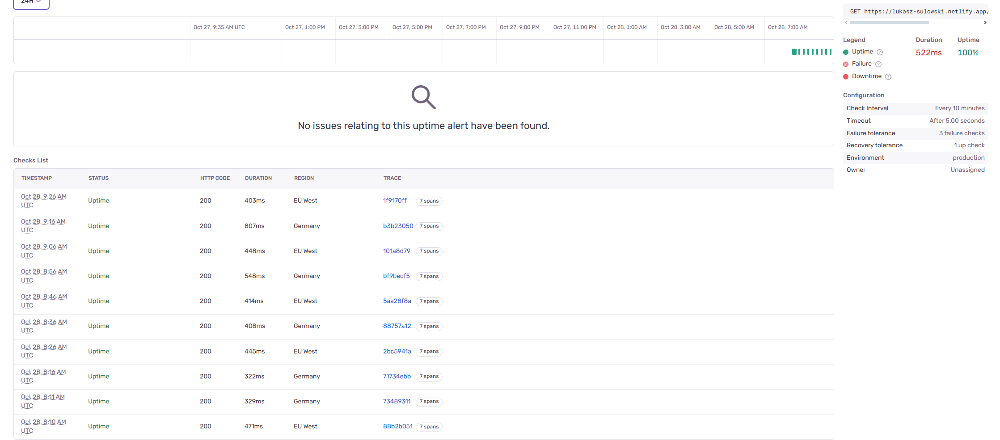
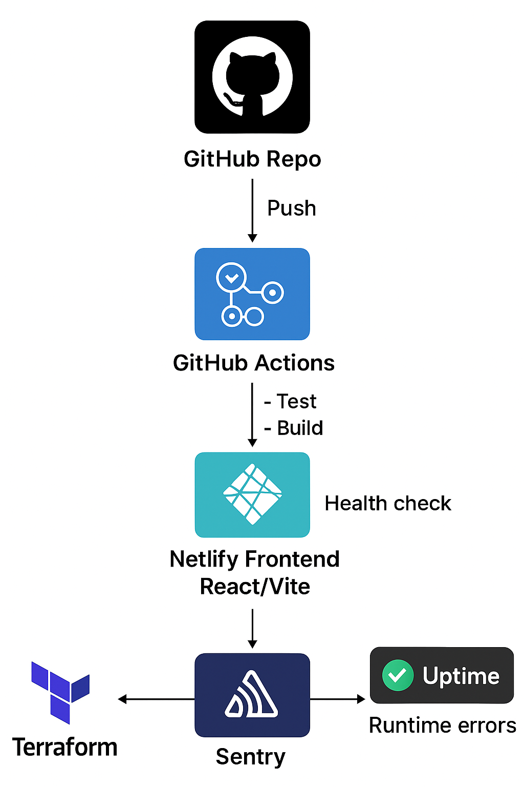

# ⚡ Frontend | SRE Portfolio

## 🧱 Stack
- **Frontend:** React (hosted on Netlify)  
- **CI/CD:** GitHub Actions (build, test & deploy pipeline)  
- **Monitoring:** `/health` endpoint + scheduled synthetic check (GitHub Actions → Sentry cron monitor)  
- **Error tracking:** Sentry (runtime monitoring)  
- **Focus:** Observability • Reliability • Automation

---

## 🚀 CI/CD

---

## 🩺 Monitoring & Observability

### 🟢 Uptime

### 🧭 Heartbeat Monitoring

> A scheduled GitHub Actions workflow ([`uptime.yml`](./.github/workflows/uptime.yml)) probes [`/health`](https://lukaszsulowski.eu/health) and the homepage every 10 minutes
> and reports each result as a check-in to a **Sentry cron monitor**, which alerts on failed checks and on missed check-ins.  
> The badges above are live: *status* is checked by Shields.io on every view, *uptime check* reflects the latest workflow run.  
> Below: example dashboards from live monitoring.

---

## 📜 Incident Log
See [`INCIDENTS.md`](./INCIDENTS.md) for recorded build and uptime incidents.

---

## 🧩 Architecture
